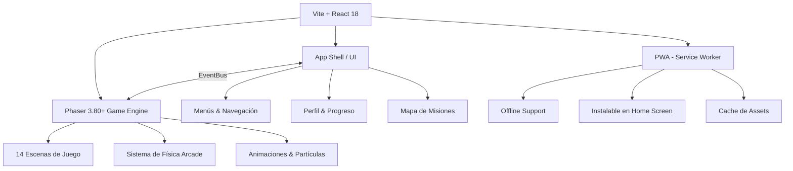
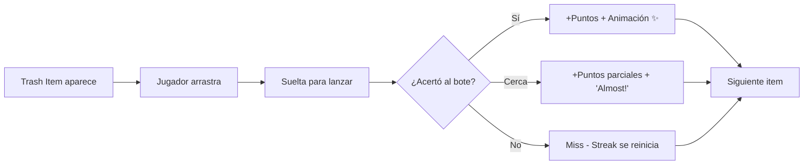
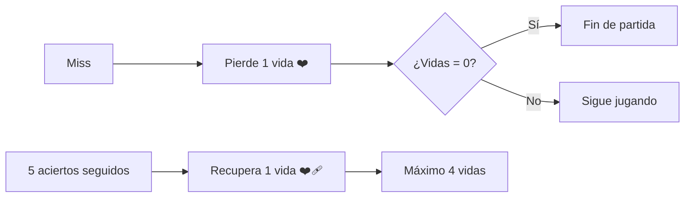
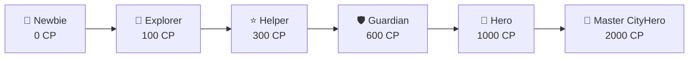

# 🏙️ CityHero Academy — Game Design Document (GDD)

> **Versión:** 1.2 (actualizado con feedback de Pablo + análisis visual del libro)  
> **Autor:** Pablo (Diseño/Contenido) + Claude (Lead Game Designer & Full-stack Dev)  
> **Fecha:** 2 de Abril, 2026  
> **Plataforma objetivo:** PWA (mobile-first, funciona en iOS Safari, Android Chrome, y desktop)

---

## 1. Visión General del Proyecto

**CityHero Academy** es una Progressive Web App educativa donde niños de 5 a 10 años aprenden comportamientos urbanos responsables a través de 14 misiones arcade. El mentor del juego es **Tommy**, un niño que guía a los jugadores con diálogos en inglés inspirados en el libro *"It's not that hard, buddy!"*.

### Filosofía de Diseño

| Principio | Descripción |
|---|---|
| **Juego infinito** | No hay "game over" definitivo. La dificultad escala progresivamente. El objetivo es superar el récord personal. |
| **Feedback positivo** | Siempre felicitar el esfuerzo, nunca castigar. |
| **Aprender jugando** | Cada mecánica refuerza un concepto urbano real. |
| **Mobile-first** | Diseñado para pantallas táctiles, optimizado para móviles de gama media-baja. |

---

## 2. Propuesta Técnica (Stack)

### Arquitectura: React Shell + Phaser.js Game Engine



### Stack Detallado

| Capa | Tecnología | Justificación |
|---|---|---|
| **Bundler** | Vite 6 | HMR ultrarrápido, build optimizado, soporte nativo ESM |
| **App Shell** | React 18 + TypeScript | Manejo de UI, rutas, estado global del progreso |
| **Game Engine** | Phaser 3.80+ | Framework completo para 2D: física arcade, sprites, audio, input táctil. Mejor opción para juegos arcade en móvil. |
| **Comunicación** | EventBus (Phaser Events) | Puente desacoplado React ↔ Phaser. React no toca el game loop. |
| **Animaciones UI** | Framer Motion | Transiciones suaves en menús y pantallas fuera del canvas de juego |
| **PWA** | vite-plugin-pwa + Workbox | Service worker automático, precaching de assets, manifest.json |
| **Persistencia** | localStorage + IndexedDB | Puntajes, progreso, preferencias. Sin backend requerido inicialmente. |
| **Audio** | Howler.js | Audio cross-browser confiable, especialmente en iOS Safari |
| **Tipografía** | Google Fonts (Outfit + Fredoka) | Outfit para UI, Fredoka para diálogos de Tommy (amigable, redondeada) |
| **i18n** | react-i18next | Textos en inglés por defecto, estructura lista para traducciones futuras |

### Estructura del Proyecto

```
/src
  /assets
    /images          # Sprites, fondos, UI elements
    /audio           # SFX y música
    /fonts           # Fuentes web
  /components        # React: Header, MissionCard, ProgressBar, etc.
  /game
    /scenes          # Phaser: BootScene, PreloaderScene, ThrowToBinScene, etc.
    /systems         # DifficultyManager, ScoreManager, PowerUpSystem
    /objects         # TrashItem, Bin, Tommy, PowerUp (game objects)
    GameConfig.ts    # Configuración de Phaser
  /hooks             # useGameProgress, useHighScore, usePhaser
  /context           # ProgressContext (estado global del jugador)
  /pages             # Home, MissionMap, MissionDetail, Profile
  /i18n              # Archivos de traducción (en.json, es.json)
  /services          # EventBus.ts, StorageService.ts
  App.tsx
  main.tsx
  sw.ts              # Service Worker
```

> [!IMPORTANT]
> **Separación de responsabilidades:** React maneja TODO lo que es UI (menús, pantallas de resultado, mapa). Phaser maneja TODO lo que es gameplay dentro del canvas. Se comunican via EventBus, nunca directamente.

---

## 3. Diseño Detallado — Misión 1: "Throw to Bin" 🗑️

### 3.1 Concepto

Tommy está en un parque y ve basura en el suelo (inspirado en el capítulo *"Keeping the City Clean"* del libro, donde Tommy le dice a un señor *"Excuse me! There's a trash can right there!"*). El jugador debe lanzar la basura al bote correcto arrastrando y soltando (mecánica de puntería tipo basketball/angry birds simplificado).

### 3.2 Intro de Tommy (Inglés)

Adaptado del tono del libro — Tommy siempre usa frases cortas, directas y amigables, terminando con su muletilla *"It's not that hard, buddy!"*:

```
🧒 Tommy appears with a speech bubble:

"Hey buddy! Someone dropped trash on the ground...
There's a bin right there! Let's help out!
Drag the trash and toss it into the right bin.
It's not that hard, buddy! Let's go! 🎯"
```

### 3.3 Mecánica Core



**Controles:**
- **Mobile:** Drag & release (tipo tirachinas). El jugador toca la basura, arrastra hacia atrás para apuntar, y suelta para lanzar. Una línea punteada muestra la trayectoria estimada.
- **Desktop:** Click & drag, mismo comportamiento.

**Elementos en pantalla:**
- **Parte inferior:** Zona de lanzamiento donde aparece el trash item
- **Parte superior:** 1-3 botes de basura (según dificultad)
- **Tommy:** En una esquina, reacciona con emojis y frases cortas
- **HUD:** Score | Combo streak | Timer (opcional en niveles avanzados)

### 3.4 Sistema de Puntuación

| Acción | Puntos | Multiplicador |
|---|---|---|
| Acierto perfecto (centro del bote) | 100 pts | × combo streak |
| Acierto normal (borde del bote) | 50 pts | × combo streak |
| Categoría correcta (reciclaje/orgánico) | +25 pts bonus | — |
| Miss (falla) | 0 pts | Streak reset a ×1 |
| Combo ×5 | — | ×2 multiplicador |
| Combo ×10 | — | ×3 multiplicador |
| Combo ×20 | — | ×5 multiplicador |

### 3.5 Escalado de Dificultad (Infinito)

La dificultad aumenta **cada 500 puntos** acumulados en una partida:

| Nivel | Puntos | Cambios |
|---|---|---|
| **1 - Easy** | 0-499 | 1 bote fijo al centro. Items lentos. Solo basura genérica. Trayectoria visible. |
| **2 - Getting Started** | 500-1499 | 2 botes (basura / reciclaje). Items un poco más rápidos. |
| **3 - Nice Work!** | 1500-2999 | 3 botes (basura / reciclaje / orgánico). Botes se mueven lateralmente (lento). |
| **4 - City Keeper** | 3000-4999 | Botes se mueven más rápido. Aparecen items "tricky" (¿dónde va un cartón con grasa?). |
| **5 - Street Hero** | 5000-7999 | Viento lateral aleatorio que afecta la trayectoria. Botes cambian de posición. |
| **6 - Eco Warrior** | 8000-11999 | Items caen del cielo que el jugador debe atrapar primero. Botes más pequeños. |
| **7 - Legend** | 12000+ | Todo lo anterior combinado. Velocidad máxima. "Survival mode". |

> [!TIP]
> **Zona "Flow":** La velocidad nunca aumenta bruscamente. Cada transición es gradual (+5% velocidad por cada 100 pts) para mantener al niño en la "zona de esfuerzo" sin frustrarlo.

### 3.6 Power-Ups Urbanos

Los power-ups aparecen aleatoriamente cada 30-60 segundos como objetos brillantes que el jugador puede tocar para activar:

| Power-Up | Ícono | Efecto | Duración | Referencia Urbana |
|---|---|---|---|---|
| **Magnet Bin** | 🧲 | Los botes atraen la basura cercana (margen de error más amplio) | 10 seg | "La ciudad te ayuda cuando colaborás" |
| **Slow Motion** | ⏳ | Todo se ralentiza al 50% | 8 seg | "Tomá tu tiempo, ciudadano responsable" |
| **Double Points** | ⭐ | Puntos ×2 | 15 seg | "¡Tu esfuerzo vale doble!" |
| **Big Bins** | 📦 | Los botes crecen al 150% de su tamaño | 12 seg | "Más infraestructura = más fácil reciclar" |
| **Tommy's Help** | 🧒 | Tommy señala el bote correcto con una flecha | 10 seg | "Un buen amigo siempre te guía" |

### 3.7 Feedback de Tommy (Inglés, durante el juego)

Basado en el tono del libro — Tommy siempre es positivo, directo, y usa "buddy" de forma natural:

```javascript
// Aciertos consecutivos
"Nice throw, buddy!"
"You're on fire! 🔥"  
"See? It's not that hard!"
"That was perfect, buddy!"
"The city looks cleaner already!"

// Al fallar
"No worries! Try again, buddy!"
"Almost there! You got this!"
"It's okay! Everyone misses sometimes 💪"

// Al recuperar una vida (5 aciertos seguidos)
"Wow! You earned a life back! Keep going!"
"That streak was amazing! Here's an extra chance!"

// Al activar power-up
"Whoa! This will help a lot!"
"Power boost, buddy!"

// Milestone de puntaje
"500 points! You're a real helper!"
"1000 points! The streets are getting cleaner!"
"Look at you go! It's really not that hard, buddy!"
```

### 3.8 Sistema de Vidas y Fin de Partida

El jugador empieza con **4 vidas** (representadas como ❤️ en el HUD). Cada miss resta una vida.

**Mecánica de recuperación:** Al lograr **5 aciertos consecutivos**, el jugador **recupera 1 vida** (máximo 4). Esto:
- Incentiva a seguir jugando incluso después de errores
- Da una sensación de "remontada" que es muy adictiva
- Premia la consistencia sin castigar a los niños que se equivocan



La partida termina cuando las **4 vidas llegan a 0**.

```
┌─────────────────────────────────┐
│                                 │
│    🏅 GREAT JOB, CITYHERO!     │
│                                 │
│    Your Score:  2,450 pts       │
│    ⭐ Personal Best: 3,200 pts  │
│    🔥 Best Combo: ×12          │
│    🎯 Accuracy: 78%            │
│    ❤️‍🩹 Lives Recovered: 3      │
│                                 │
│    Tommy says:                  │
│    "Wow! You cleaned up 47      │
│     pieces of trash! The park   │
│     looks amazing now!          │
│     It's not that hard, buddy!  │
│     🌳"                        │
│                                 │
│   ┌─────────────────────────┐   │
│   │    🔄 TRY AGAIN!       │   │
│   └─────────────────────────┘   │
│                                 │
│   ┌─────────────────────────┐   │
│   │    🗺️ BACK TO MAP       │   │
│   └─────────────────────────┘   │
│                                 │
│    Share your score! 📤         │
│                                 │
└─────────────────────────────────┘
```

> [!NOTE]
> El mensaje de Tommy en la pantalla final varía según el puntaje. Siempre es **positivo**. Nunca decimos "you lost" o "game over". Usamos "Great job!", "Amazing effort!", etc. Tommy siempre termina con una variación de *"It's not that hard, buddy!"*.

---

## 4. Style Guide para Assets 🎨

### 4.1 Paleta de Colores

| Rol | Color | Hex | Uso |
|---|---|---|---|
| **Primary** | Azul Cielo | `#4DA6FF` | Botones principales, headers |
| **Secondary** | Verde Parque | `#5CD85C` | Progreso, aciertos, naturaleza |
| **Accent 1** | Amarillo Sol | `#FFD93D` | Estrellas, puntos, highlights |
| **Accent 2** | Naranja Energía | `#FF8C42` | Power-ups, alertas amigables |
| **Accent 3** | Rosa Coral | `#FF6B8A` | Badges, logros especiales |
| **Background Light** | Crema Suave | `#FFF8F0` | Fondo de menús |
| **Background Dark** | Azul Noche | `#1A1A3E` | Modo nocturno (futuro) |
| **Text Primary** | Gris Grafito | `#2D3436` | Texto principal |
| **Text Light** | Blanco | `#FFFFFF` | Texto sobre colores |

### 4.2 Tipografía

| Uso | Fuente | Peso | Tamaño |
|---|---|---|---|
| Títulos / Headers | **Fredoka One** | Bold (700) | 28-48px |
| Diálogos de Tommy | **Fredoka** | Medium (500) | 18-22px |
| UI General | **Outfit** | Regular-Semi (400-600) | 14-18px |
| Números / Scores | **Outfit** | Bold (700) | 24-36px |

### 4.3 Estilo Visual: "Friendly Flat" (Lingokids / ABCmouse)

**Referencia principal:** Lingokids × ABCmouse × Duolingo Kids

**El libro** *"It's not that hard, buddy!"* **es referencia SOLO para las características físicas de Tommy** (pelo, ropa, piel, expresiones). El estilo artístico del juego es completamente flat/vector.

**Características del estilo:**
- **Flat vector art**: líneas limpias, formas simples, sin texturas complejas
- Bordes redondeados en TODO (mínimo `border-radius: 16px`)
- Sombras suaves (`box-shadow` con baja opacidad, nunca sombras duras)
- Sin contornos negros gruesos — usar separación por color
- Gradientes sutiles (máximo 2 colores, siempre suaves)
- Personajes con **proporciones chibi/cartoon** (cabeza grande, cuerpo pequeño)
- **Colores vibrantes** y saturados, paleta alegre
- Fondos simples y limpios, no detallados ni realistas
- Animaciones fluidas con transiciones suaves

### 4.4 Tommy — Diseño del Personaje

**Características de Tommy** (basadas en el libro, renderizadas en estilo flat/Lingokids):

| Rasgo | Descripción |
|---|---|
| **Edad** | ~7-8 años |
| **Pelo** | Castaño/marrón oscuro, corto, despeinado con mechones que sobresalen |
| **Ojos** | Grandes, redondos, expresivos, de color oscuro (marrón) |
| **Piel** | Tono cálido, ligeramente bronceada |
| **Expresión** | Sonrisa amplia, confiada, amigable — siempre positivo |
| **Outfit principal** | Camiseta **blanca** lisa + shorts/bermudas **azul marino** |
| **Outfit alternativo** | Chaleco azul sobre camiseta blanca, o remera azul con mochila roja |
| **Calzado** | Zapatillas azules con medias blancas |
| **Mochila** | Mochila **roja/naranja** |
| **Proporciones** | Estilo chibi — cabeza proporcionalmente grande, cuerpo compacto |

**Prompt para generar a Tommy:**

```
PROMPT PARA TOMMY (Antigravity/Midjourney):

"A friendly cartoon boy character named Tommy, age 7-8, for a children's 
educational game app. Art style: clean flat vector illustration, similar 
to Lingokids and ABCmouse characters.

Physical features: Short messy brown hair with tousled strands sticking 
up, large expressive round dark brown eyes, warm tan skin tone, wide 
confident friendly smile. Small nose, round face.

Outfit: Plain white t-shirt, navy blue shorts/bermudas, blue sneakers 
with white socks. Sometimes wears a red/orange backpack.

Style: Clean flat vector art, no outlines, soft rounded shapes, 
minimal shading with subtle gradients. Cheerful and confident 
expression. Background: transparent/none. Similar to Lingokids 
and ABCmouse character design.

Poses needed: standing happy with hands on hips, pointing right, 
thumbs up, thinking (hand on chin), celebrating (arms up), waving 
hello, holding trash item, tossing something.

Color palette: White shirt, #1B3A5C navy shorts, #8B4513 brown hair, 
warm skin tone. Clean white background, PNG with transparency."
```

### 4.5 Prompts para Objetos del Juego

```
PROMPT PARA TRASH ITEMS:

"Set of cartoon trash items for a children's recycling game. Flat 
vector style, clean lines, no outlines, bright colors. Items include: 
crumpled paper, plastic bottle, banana peel, apple core, aluminum can, 
cardboard box, glass jar, candy wrapper, juice box, newspaper. 
Each item on transparent background, cheerful and non-gross appearance. 
Style: Lingokids / Duolingo flat illustration. PNG with transparency."
```

```
PROMPT PARA RECYCLING BINS:

"Set of 3 cartoon recycling bins for a children's game. Flat vector 
style, rounded shapes, friendly appearance with small faces (eyes). 
Colors: Blue bin (general waste), Green bin (organic/compost), Yellow 
bin (recyclables). Each bin has a small icon on the front showing 
what goes inside. Style: cute, kawaii-inspired, Lingokids aesthetic. 
Clean flat colors, no heavy outlines. PNG with transparency."
```

```
PROMPT PARA FONDOS:

"Cartoon city park background for a children's educational game. 
Flat vector illustration style similar to Lingokids and ABCmouse. 
Features: green grass, colorful trees, a walking path, park bench, 
friendly city skyline in the background with rounded buildings. 
Bright daylight, blue sky with fluffy white clouds. 
Colors: vibrant greens, soft blues, warm yellows, cheerful palette. 
Style: clean flat vector art, no textures, simple shapes, 
Lingokids / ABCmouse aesthetic. 
No people, clean and cheerful. Wide format 16:9."
```

---

## 5. Sistema de Progreso 🏆

### 5.1 Puntos de Experiencia (XP)

Cada misión otorga **CityPoints (CP)** que se acumulan globalmente:

| Acción | CP ganados |
|---|---|
| Completar una partida | 10 CP base |
| Superar tu Personal Best | +25 CP bonus |
| Alcanzar 1000 pts en una partida | +15 CP |
| Primera vez jugando una misión | +30 CP |
| Jugar 3 misiones diferentes en un día | +20 CP bonus |

### 5.2 Rangos del CityHero



| Rango | CP Requeridos | Título en UI | Reward |
|---|---|---|---|
| 🌱 **Newbie** | 0 | *"Welcome to the city!"* | Acceso inicial + avatar básico |
| 🏃 **Explorer** | 100 | *"You're learning fast!"* | Avatar frame especial |
| ⭐ **Helper** | 300 | *"The city needs you!"* | Tommy outfit alternativo (chaleco azul) |
| 🛡️ **Guardian** | 600 | *"You're making a difference!"* | Tema visual especial |
| 🦸 **Hero** | 1000 | *"A true CityHero!"* | Badge dorado + efectos especiales |
| 👑 **Master CityHero** | 2000 | *"The city's greatest champion!"* | Modo "Endless Challenge" + crown avatar |

> [!NOTE]
> **Acceso libre + Freemium-ready:** Todas las 14 misiones están disponibles desde el inicio. Los rangos otorgan recompensas cosméticas (outfits, frames, temas) pero NO bloquean contenido. 
>
> **Preparación para modelo freemium futuro:** La arquitectura incluirá un `AccessManager` con flags por misión (`isFree: boolean`). Actualmente todas estarán en `true`. Cuando se implemente el modelo de suscripción, simplemente se cambian los flags para las misiones premium. El UI ya mostrará un ícono de 🔒 y un modal de "Upgrade to unlock!" cuando `isFree = false`.

### 5.3 Badges (Logros)

Badges únicos por misión + badges globales:

**Badges por Misión (Throw to Bin como ejemplo):**
- 🥉 **"First Toss"** — Completa tu primera partida
- 🥈 **"Clean Streak"** — Logra un combo de ×10
- 🥇 **"Recycling Pro"** — Alcanza 5000 pts en una partida
- 💎 **"Zero Waste Legend"** — Alcanza 10000 pts sin más de 5 misses totales

**Badges Globales:**
- 🌍 **"City Explorer"** — Jugá las 14 misiones al menos una vez
- 🔥 **"On Fire!"** — Jugá 7 días seguidos
- 🏆 **"City Hero"** — Tené al menos un badge 🥇 en cada misión

### 5.4 Mapa de Misiones (UI)

El mapa de misiones es una **vista isométrica de una ciudad** donde cada misión es un edificio/lugar:

```
┌──────────────────────────────────────────┐
│           🏙️ CITYHERO CITY MAP           │
│                                          │
│   [Park]🌳    [Street]🛣️   [School]🏫   │
│   Mission 5    Mission 1    Mission 11   │
│                                          │
│   [Garden]🌻  [Plaza]⛲    [Hospital]🏥  │
│   Mission 10   Mission 3    Mission 13   │
│                                          │
│   ... (scrolleable)                      │
│                                          │
│  ──────────────────────────────────────  │
│  🌱 Explorer  ████████░░  180/300 CP     │
│  ⭐ Next: Helper                         │
└──────────────────────────────────────────┘
```

---

## 6. Las 14 Misiones — Resumen de Mecánicas

| # | Misión | Mecánica Core | Concepto Urbano |
|---|---|---|---|
| 1 | **Throw to Bin** 🗑️ | Puntería: drag & toss basura al bote correcto | Manejo de residuos y reciclaje |
| 2 | **Lane Rush** 🏃 | Runner lateral: esquiva obstáculos en la acera | Respetar carriles peatonales |
| 3 | **Recycling Sorting** ♻️ | Sorting rápido: arrastra items al contenedor correcto (conveyor belt) | Clasificación de residuos |
| 4 | **Clean the Street** 🧹 | Swipe/tap para barrer basura antes que pase el tiempo | Mantener limpio el espacio público |
| 5 | **Fix the Park** 🔧 | Puzzle de arrastrar: coloca elementos rotos en su lugar | Cuidado de espacios verdes |
| 6 | **Save Resources** 💧 | Tap timing: cierra grifos/luces cuando no se usan | Ahorro de agua y energía |
| 7 | **Dog Maze** 🐕 | Laberinto táctil: guía al perro recogiendo "poops" | Responsabilidad con mascotas |
| 8 | **The Silent Zone** 🤫 | Timing/rhythm: mantén el silencio cerca del hospital | Respeto por zonas de silencio |
| 9 | **Zebra Cross** 🦓 | Timing arcade: cruza peatones en el momento seguro | Seguridad vial |
| 10 | **Urban Gardener** 🌱 | Tap & grow: planta y riega en secuencia correcta | Agricultura urbana |
| 11 | **Bus Stop** 🚌 | Queue management: organiza la fila del bus correctamente | Civismo en transporte público |
| 12 | **Light the Way** 💡 | Puzzle de conexión: conecta cables para iluminar calles | Infraestructura urbana |
| 13 | **Hydration Station** 💧 | Catch game: atrapa gotas de agua, evita contaminantes | Agua limpia y salud |
| 14 | **City Planner** 🏗️ | Sandbox builder: coloca edificios siguiendo reglas urbanas | Planificación urbana básica |

---

## 7. Decisiones Confirmadas ✅

| Decisión | Resultado |
|---|---|
| **Stack técnico** | ✅ Aprobado: Vite + React + Phaser.js |
| **Desbloqueo de misiones** | ✅ Todas libres desde el inicio, con estructura freemium-ready |
| **Sistema de vidas** | ✅ 4 vidas + recuperación cada 5 aciertos consecutivos |
| **Apariencia de Tommy** | ✅ Basada en las ilustraciones del libro (camiseta blanca, shorts azul marino, pelo castaño despeinado, mochila roja) |
| **Tono de diálogos** | ✅ Adaptados al estilo del libro ("buddy", "It's not that hard!") |
| **Libro de referencia** | ✅ PDF analizado (38 páginas, 15+ capítulos temáticos) |

## 8. Pendiente de Confirmación

> [!IMPORTANT]
> ### Pablo, solo necesito confirmar:
>
> 1. **¿Arrancamos con Throw to Bin como misión piloto?** Sugiero: primero el shell de la app (Home + Map + sistema base) y luego Throw to Bin completa como primer juego funcional.
>
> 2. **¿El capítulo del libro que más se relaciona con Throw to Bin es "Keeping the City Clean" (cap 3)?** Quiero usar diálogos fieles de ese capítulo.
>
> 3. **¿Querés que genere a Tommy como imagen de prueba ahora para validar el estilo visual antes de arrancar a programar?**

---

## 8. Verification Plan

### Fase Piloto (Misión 1 - Throw to Bin)

#### Automated Tests
- Unit tests para `ScoreManager`, `DifficultyManager`, `PowerUpSystem`
- Test de rendimiento: 60 FPS estable en dispositivos móviles (Chrome DevTools throttling)
- Lighthouse PWA audit: score ≥ 90 en Performance, PWA, Accessibility

#### Browser Testing
- Verificar mecánica de drag & release en Chrome mobile (emulado)
- Verificar responsive en viewport 360×640 (móvil) y 1920×1080 (desktop)
- Test de instalación como PWA (Add to Home Screen)
- Test offline: el juego debe funcionar sin conexión una vez cargado

#### Manual Verification
- Pablo prueba el juego en su dispositivo real
- Verificar que los diálogos de Tommy se sienten naturales y alineados con el libro
- Validar que la curva de dificultad se siente justa para un niño de 5-10 años
